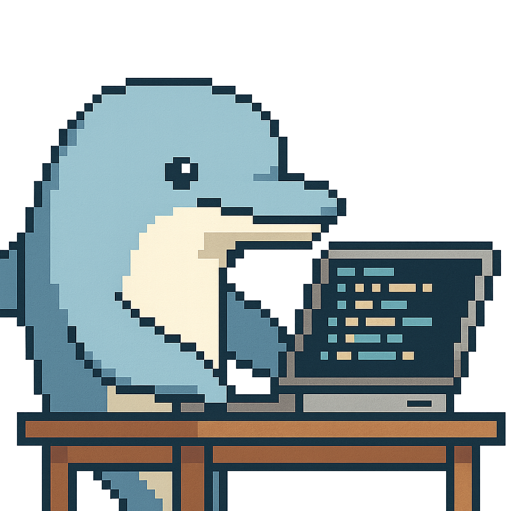

#  Hey! Welcome to my GitHub profile
---
## Whoami
I'm Egor, a Python developer actively learning and experimenting in the fields of Machine Learning and Data Science. I'm focused on gaining hands-on experience through personal projects, and I'm always eager to explore new tools, algorithms, and approaches to intelligent systems

<!--
**Eg0Mak/Eg0Mak** is a ✨ _special_ ✨ repository because its `README.md` (this file) appears on your GitHub profile.

Here are some ideas to get you started:

- 🔭 I’m currently working on ...
- 🌱 I’m currently learning ...
- 👯 I’m looking to collaborate on ...
- 🤔 I’m looking for help with ...
- 💬 Ask me about ...
- 📫 How to reach me: ...
- 😄 Pronouns: ...
- ⚡ Fun fact: ...
-->
